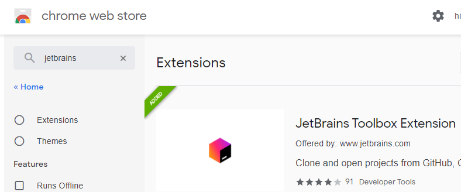
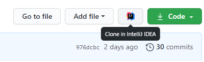
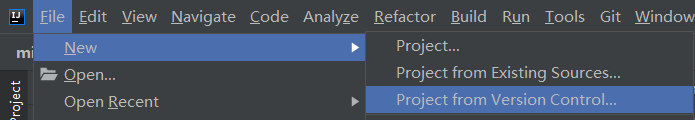
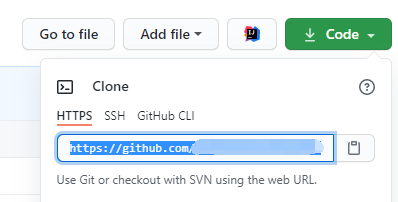

# how-to-use-plugin-template

如何使用 [mirai-console-plugin-template](https://github.com/project-mirai/mirai-console-plugin-template).

1. 创建项目
   1. 点击绿色按钮 "Use this template" (*[绿色按钮在哪?](.github/WhereIsTheGreenButton.png)*)

   2. 填写 Repository name, 即项目名. 可选填写 Description 即项目描述.
      如果你想让其他人看到你的项目, 请选择 'Public', 否则选择 'Private'----这样只有你自己和你授权的人才能看到

   3. 点击绿色按钮 "Create repository from template". 这将会创建一个项目到你的 GitHub 账户.

   4. 使用你的 IDE 克隆并引入新建的项目 (*[怎么做?](#如何使用-intellij-idea-克隆并引入-github-项目)*)

2. 修改模板
   1. 打开 `settings.gradle.kts`, 修改最后一行:
      ```kotlin
      rootProject.name = "mirai-console-plugin-template" // 这是项目名称, 修改为你自己的.
      ```

   2. 打开 `build.gradle.kts`, 参考 [Mirai 版本选择](https://github.com/mamoe/mirai/blob/dev/docs/ConfiguringProjects.md), 将
      ```
      id("net.mamoe.mirai-console") version "2.4.1"
      ```
      中的 `2.4.1` 修改为你需要的 Mirai 版本号. 通常把它更改为最新的稳定版本号最佳.

   3. 打开 `src/main/kotlin/PluginMain.kt`, 修改里面的插件描述信息
   4. 修改包名 (默认包名为 `org.example.mirai.plugin`):
      1. 修改第一行 `package`
      2. 
   5. 修改主类类名 (可选) (*[怎么做?](.github/HowToRename.png)*)

3. 运行测试

   模板配置了 [Mirai Console 嵌入启动][嵌入启动], 你可以在 `src/test/kotlin/RunMirai.kt` 找到.

   你可以通过 `Run Configuration` 启动 (*[怎么做?](.github/HowToUseRunConfiguration.png)*), 或者通过 `main` 函数旁边的图标启动 (*[怎么做?](.github/HowToRunViaGutter.png)*)

   `loginTestBot` 将会登录一个测试账号, 如果不需要, 可以删除.

4. 开始开发

5. 发布插件

   要打包插件 JAR 文件: 执行 Gradle 任务 `buildPlugin` (*[如何在 IntelliJ IDEA 中做?](.github/HowToRunBuildPluginInIDEA.png)*, *[如何在命令行做?](.github/HowToRunBuildPluginInCommandLine.png)*)

   这个 JAR 文件后缀为 `.mirai.jar`, 可以放入 Mirai Console `plugins` 目录被加载.

   如果你感兴趣, 也可以在 [Mirai 官方论坛](https://mirai.mamoe.net/category/6/%E9%A1%B9%E7%9B%AE%E5%8F%91%E5%B8%83) 发布插件, 让更多人使用到你的插件.


请在你的项目中删除本文, 并修改为你插件的描述.

[嵌入启动]: https://github.com/mamoe/mirai-console/blob/master/docs/Run.md#%E5%B5%8C%E5%85%A5%E5%BA%94%E7%94%A8%E5%90%AF%E5%8A%A8%E5%AE%9E%E9%AA%8C%E6%80%A7

## 附录

如果你已经完成了上文阅读, 不需要阅读这个章节.

注意, Android Studio 是基于 IntelliJ IDEA 开发的, 本教程同样适用于 Android Studio.

### 如何使用 IntelliJ IDEA 克隆并引入 GitHub 项目

如果你同时使用 Google Chrome, 能访问 [Chrome 插件中心](https://chrome.google.com/webstore/category/extensions?hl=en), 且使用 [JetBrains Toolbox](https://www.jetbrains.com/toolbox-app/):
1. 安装插件 `JetBrains Toolbox Extension`

   

2. 重启 Chrome

4. 现在 GitHub 克隆按钮旁边会多出一个按钮使用 IntelliJ IDEA 打开:

   


如果你不使用上述工具,
1. 打开 IntelliJ IDEA, 点击 `File -> New -> Project from Version Control`

   

2. URL 填入从这里获得的你项目的 Git 地址:

   

3. 点击 Clone.